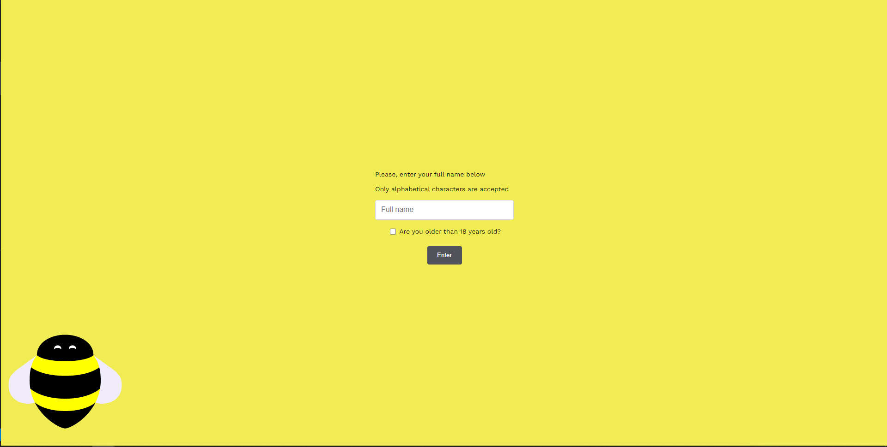
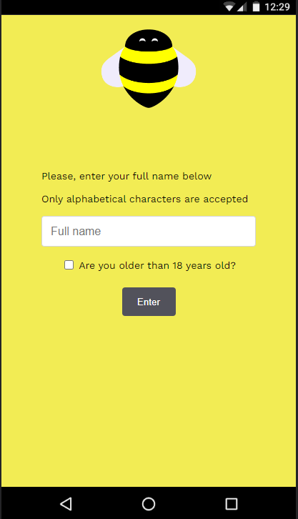
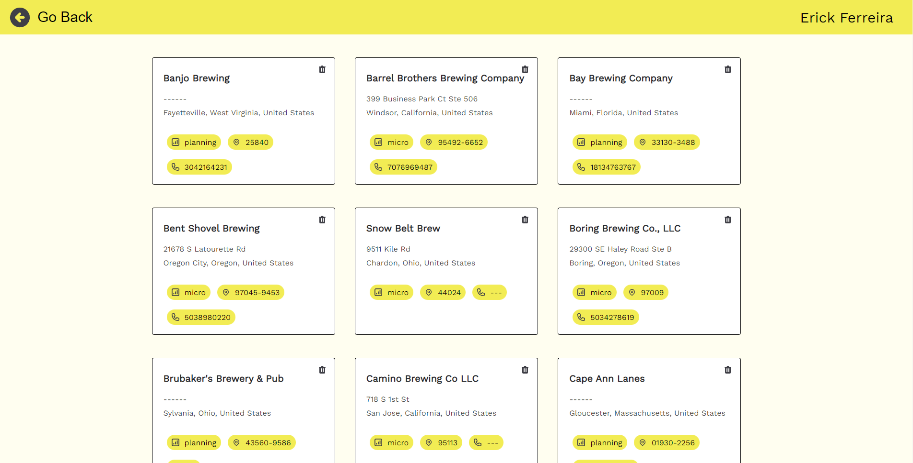
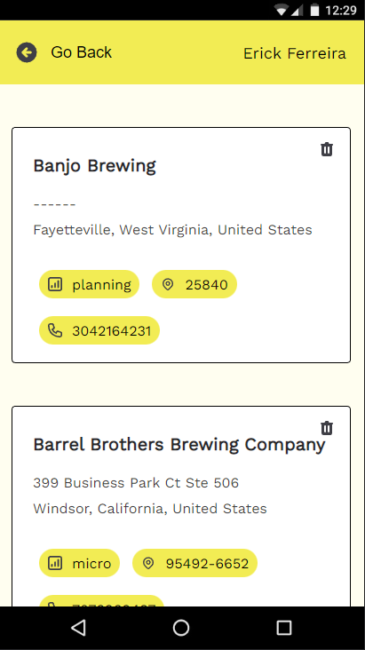

# Desafio Front-End Bees

### ReactJS v8.1.0

 
Desenvolvimento de uma lista de contatos com autenticação e integrado a [API publica](https://www.openbrewerydb.org/documentation).

 

Oque foi desenvolvido:

---

> ### Foco Principal
>
> 1.  Estruturação de pastas.
> 2.  Desenvolvimento da tela baseado do [Figma](https://www.figma.com/file/uFEUiFI47Ap1wSfWaEHSnI/BEES-front-end-challenge?node-id=0%3A1).
> 3.  Responsividade.
> 4.  Autenticação
> 5.  Rotas privadas
> 7.  Console de erro
> 8.  Validação de form
> 9.  Manipulação do estado
>
> ### Extra
>
> 1. Testes Unitários Jest / Testing Library
> 2. Rotas privadas
> 4. Lint
> 5. Prettier
> 6. Loading
> 7. Husky (pré-commit)
> 6.  TypeScript
> 8. Estado Vazio
> 8. Lazy Loading
> 9.  Gerenciamento de estado local e global
> 10.  Historico de commits
>
> #

---

 

Executando o projeto:

---

    $ git clone https://github.com/erickkf600/bees-dash.git

    / entre na pasta do projeto

    $ npm install

---

    $ npm run start

---

 
Executando lint:

---

    $ npm run lint

    / ou para possiveis correções

    $ npm run lint:fix

---

 
Executando Teste Unitários:

---

    $ npm run test

---

 

Preview:

---

> ### LOGIN
>
> 
> 
> 
> 

> ### HOME
>
> 
> 
> 
> 

  

#### Arquitetura do Projeto

---

 
Abrir

 <pre>
├───assets
│   ├───img
│   └───preview
├───enums
├───interfaces
├───pages
│   ├───Home
│   └───Login
├───routing
├───services
│   └───http
├───shared
│   ├───components
│   │   ├───Component-loader
│   │   └───Header
│   ├───providers
│   └───styled-components
└───styles
    ├───layout
    └───utils
 </pre>

  

#### Libs Utilizadas

---

-   [React Hook Form](https://react-hook-form.com/)
-   [Yup](https://www.npmjs.com/package/yup)
-   [Sass](https://sass-lang.com/)
-   [React Router Dom](https://reactrouter.com/web/guides/quick-start)
-   [Axios](https://github.com/axios/axios)
-   [Styled Components](https://styled-components.com/)

#### DEV dependencies

---

-   [jest](https://jestjs.io)
-   [husky](https://typicode.github.io/husky/#/)
-   [prettier](https://prettier.io/)
-   [eslint](https://eslint.org/)

-   [jest - Plugins]()

    -   [@testing-library/dom]()
    -   [@testing-library/user-event]()
    -   [@testing-library/jest-dom]()
    -   [@testing-library/react]()
    -   [@types/jest]()
    -   [@types/node]()
    -   [@hookform/resolvers]()

-   [EsLint - Plugins](#EsLintPlugins)
    -   [eslint-config-prettier]()
    -   [eslint-plugin-prettier]()
    -   [eslint-plugin-import]()
    -   [eslint-plugin-react]()
    -   [eslint-plugin-react-hooks]()

  

## Responsável

<table>
  <tr>
    <td align="center">
      <a href="#">
         
        
          <b>Erick Ferreira</b>
        
      </a>
    </td>
  </tr>
</table>
